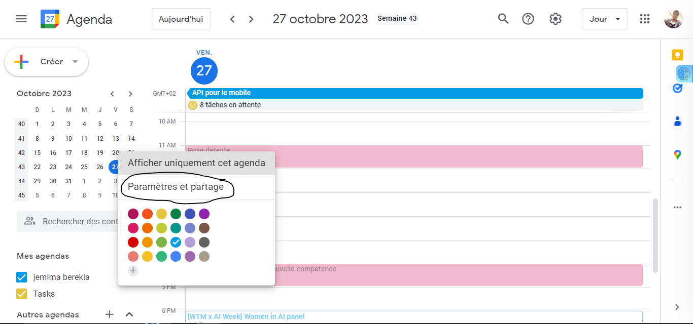
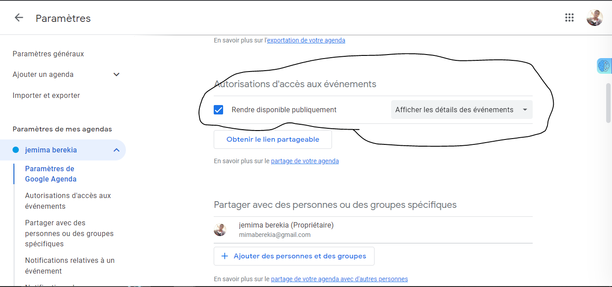
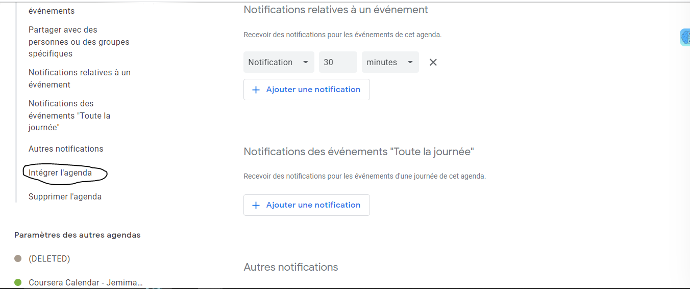
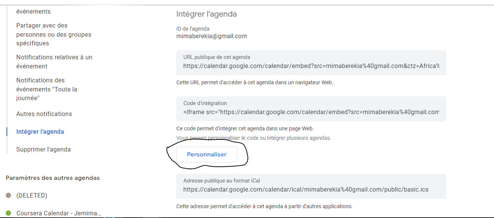
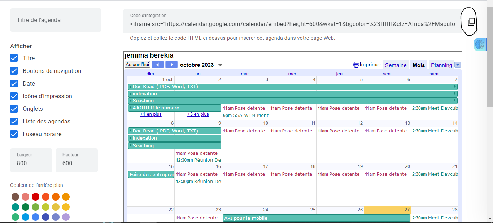

1. avoir un compte google
2. avoir on propre calendier des evenements, et y acceder
3. aller sur parametre et partager

4. 
5. 
6. 
7. 
8. integrer dans votre code  en suprimant le ![frameborder="0" scrolling="no"]

tirer de la video : https://www.youtube.com/watch?v=MF3yXhiHN6k

Yemi berekia